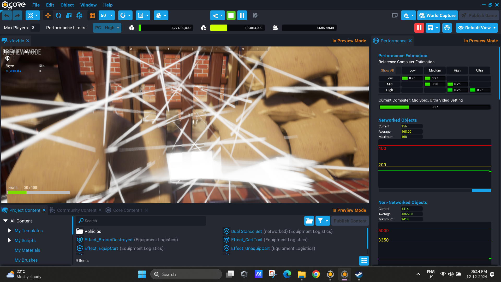
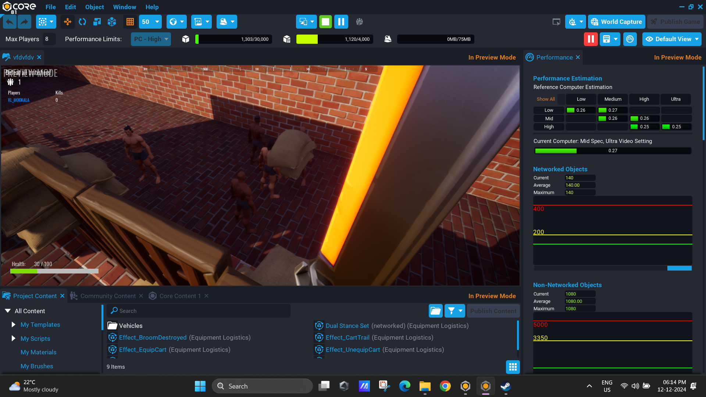
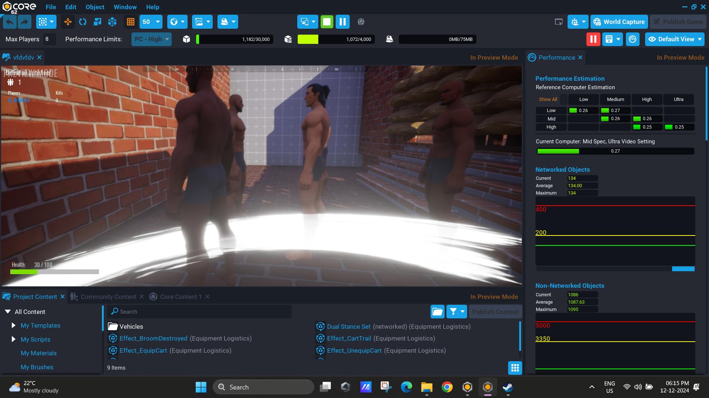
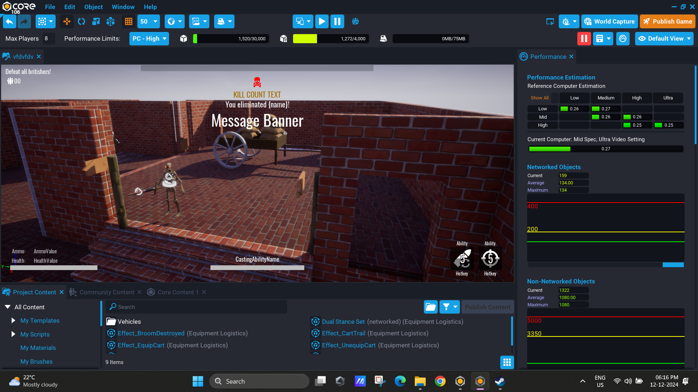
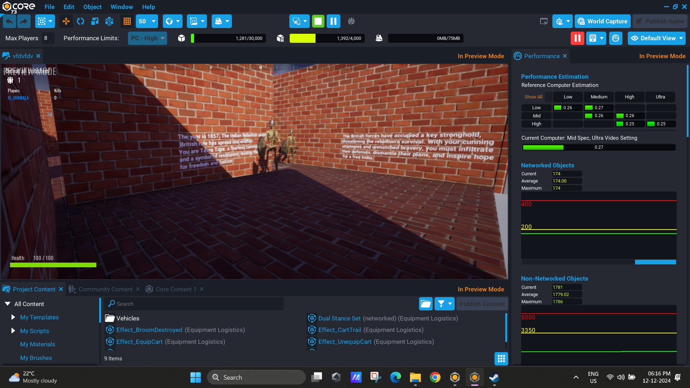

# Echoes of Time

## Game Link

You can play this game [**Echoes of Time**](https://www.coregames.com/games/167581/echoes-of-time).

## Screenshots

### Screenshot 1: Gameplay Interface

### Screenshot 2: Character Selection

### Screenshot 3: Historical Scene

### Screenshot 4: Interactive Quiz

### Screenshot 5: End of Mission

## About the Game

**Echoes of Time** is an educational game designed to immerse players in historical events while engaging them through interactive storytelling. The game takes players on a journey through key moments in India's history, including the Salt March, as part of a role-playing experience.

### Key Features:
- **Historical Accuracy**: Dive deep into the rich history of India's independence movement.

- **Interactive Gameplay**: Play as Mahatma Gandhi and make choices that influence the game's outcomes.

- **Educational Content**: Learn about key events and figures in Indian history through quizzes and decisions.

